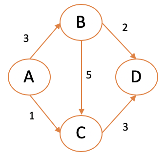
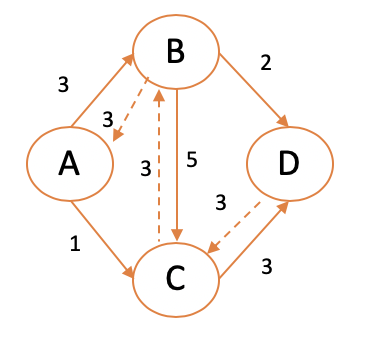
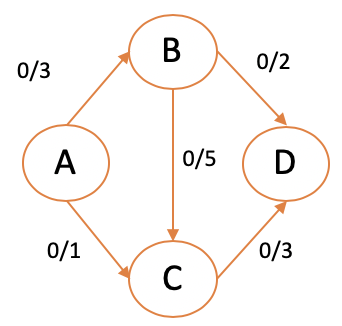
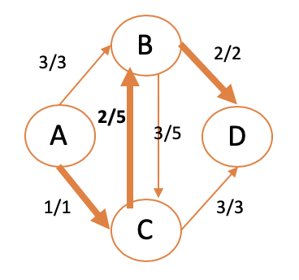

# Problema de flujo máximo: algoritmo de Ford-Fulkerson

## Problema de flujo máximo

El problema de flujo máximo es un problema de optimización para determinar la cantidad máxima de elementos que puede ir de un nodo *i* hasta un nodo *j* en un grafo. Este grafo suele representar una red, como por ejemplo la red de tuberías de un edificio, la red de carreteras de una ciudad o una red privada.

### Ejemplo: agua a través de un grafo

Considera el siguiente grafo dirigido con 4 nodos que representa las tuberías de una casa. El nodo *A* será el lavamanos (el origen del flujo) y el nodo *D* será el desagüe de la casa (el final del flujo). Queremos saber cuánta agua podemos echar por el lavamanos antes de que se tapen las cañerías.



De forma ingenua utilizaríamos un algortimo greedy para encontrar la arista que más capacidad tuviese entre cada nodo, desde el originen *A* hasta llegar al nodo destino *D*. Claramente el flujo máximo de nuestro grafo sólo puede ser igual a la capacidad máxima de las arista con menos capacidad por la que tiene que pasar el flujo hasta llegar a *D*. Aquí el flujo máximo dependerá de cuántas aristas pueden llegar hasta ese destino (2 en este caso). Esto nos daría un resultado erróneo.


## Flujo o capacidad residual
<!-- Para entender lo que es la capacidad residual del grafo, primero inicializamos el flujo de cada arista a 0 (actualmente sale 0 agua desde nuestro lavamanos).  -->
Si nos fijamos en la figura anterior vemos que las dos aristas que llegan al nodo *D* tienen capacidad 2 y 3, y estamos utilizando sólo la arista con capacidad 3. Lo que deberíamos hacer es utilizar esa capacidad de la otra arista que llega al nodo *D*. Pero, ¿cómo podemos llevar el agua hasta la arista 2?

### Capacidad residual

La capacidad residual es aquella que queda libre cuando no se aprovecha del todo en una dirección. También se puede decir que la capacidad residual de una arista dirigida es la capacidad menos el flujo que pasa por ella. Por ejemplo, la capacidad residual del nodo *B* al *C* sería 2 si utilizamos todo el flujo que le llega (3). Esa capacidad es igual a *c_o - c_d*, es decir, la capacidad de origen menos la del destino. Y en esto consiste el algoritmo de Ford-Fulkerson, en aprovechar esa capacidad residual para dibujar otro camino y permitir el transporte de más agua.



### El algortimo de Ford-Fulkerson


Este algoritmo es bastante parecido a un BFS pero con la diferencia de que hay que construir el grafo de flujo residual. Una vez construido podemos averiguar cuál es el flujo máximo de la red de agua.

1. Inicializamos el flujo de cada arista a 0.
2. construimos el grafo de capacidad residual para ese grafo. Este grafo residual es el mismo grafo con los mismos vértices y aristas pero utilizamos las capacidades residuales como capacidades.



Una vez tenemos construido el grafo de capacidad residual, podemos calcular el flujo máximo:


1. Usar BFS o DFS para encontrar un camino de *A* a *D* que tenga capacidad disponible.

2. Actualizar la capacidad de cada arco del grafo: debe indicar la máxima capacidad que puede viajar en el grafo residual. Para encontrar esa capacidad tenemos que mirar en todas las aristas *e* en el camino y restar la capacidad original de cada arista (**c_e - f_e**). Inicializamos ```cap(P)``` al menor valor de **c_e - f_e** ya que ese será el cuello de botella.
3. Ahora aumentamos el flujo en las aristas de P añadiendo la capacidad. Para el flujo en la dirección contraria restamos el valor de capacidad.
4. Actualizar el grafo con los valores obtenidos.
5. Repetir hasta que no haya caminos desde *A* a *D* en el grafo residual.


Y este es el algoritmo de Ford-Fulkerson que nos permite calcular el flujo máximo de una red.

Antes de terminar quiero resaltar algo: en la siguiente imagen vemos que el flujo total de la tubería de B a C no está copado, ya que ha utilizado 3/5 de su capacidad. Todavía es posible utilizar esos 2 puntos de capacidad para que el flujo de agua vaya en la dirección contraria:


