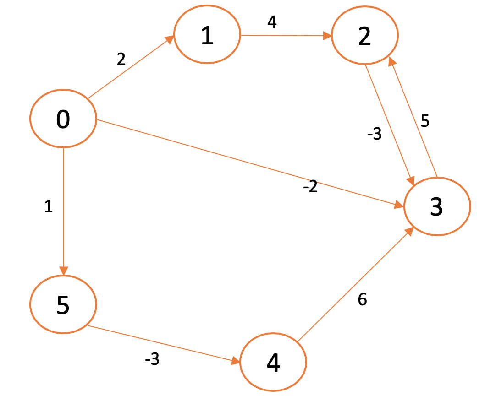

# Single Source Shortest Path - Algoritmo Bellman-Ford

Cuando queremos encontrar el camino más corto desde un nodo a otro en un grafo dirigido con pesos en las aristas normalmente utilizamos el algortimo de Dijkstra. Sin embargo Dijkstra no consigue encontrar la solución cuando los pesos son negativos. El algoritmo de Bellman-Ford resuelve este problema calculando primero las distancias entre los nodos separados por una arista, luego las distancias entre nodos separados por dos aristas, etc. Es algo similar a Programación Dinámica, donde utilizamos los resultados previos para resolver el problema en el estado actual. La principal desventaja de Bellman-Ford es que su complejidad es O(VE) mientras que Dijkstra tiene una complejidad O(V log(V)).

## Ejemplo

En la siguiente figura tenemos un grafo dirigido con pesos en las aristas de los nodos. Para poder encontrar el camino más corto Dijkstra no nos sirve porque para ir del nodo 0 al 4, el algoritmo Greedy que utiliza Dijkstra nos enviaría de del nodo 0 al nodo 2, del 3 al 2, 2 al 3, etc.




### Algoritmo Bellman-Ford

El algoritmo de Bellman-Ford lo que hace es examinar cada nodo (en un orden aleatorio) y verificar cuál es la distancia más corta hasta el momento. Esta distancia más corta la almacenamos en un vector, inicializando todos sus elementos a INT_MAX **excepto el elemento que corresponde al nodo origen**. Para poder hacer una actualización de las distancias en el vector necesitaremos una función que evaluará si la nueva distancia calculada es menor. La función es la siguiente:

```c++
void relax(int u, int v, int weight){
    if (dist[u] != INT_MAX && dist[u] + weight < dist[v]) {
        dist[v] = dist[u] + weight;
    }
}
```

Esta función deberemos ejecutarla para cada nodo ```v - 1``` veces. Esto es debido a que si una vez iterados todos los nodos seguimos reduciendo el coste del camino, es que hemos llegado a un ciclo con pesos negativos.

#### Ejecución de Bellman-Ford en el grafo de ejemplo

Primero empezamos con el nodo 0, y le asignamos una distancia de 0 para llegar a si mismo. Vamos a iterar sobre todas las aristas del grafo, empezando por una aleatoria, por ejemplo la (2,3). EL estado inicial es el siguiente:

| 0 | 1 | 2 | 3 | 4 | 5 |
|---|---|---|---|---|---|
| 0 | INT_MAX | INT_MAX | INT_MAX | INT_MAX | INT_MAX |

Ejecutando la función ```relax(2, 3, 6)``` no podríamos hacer nada, ya que ```if (dist[u] != INT_MAX && dist[u] + weight < dist[v])``` retornaría ```false``` debido a ```dist[u] != INT_MAX```.  Retornaría ```true``` y cambiaríamos la distancia de u a v cuando empecemos por el nodo 0 hacia 1, 2 o 2 obteniendo la siguiente tabla:

| 0 | 1 | 2 | 3 | 4 | 5 |
|---|---|---|---|---|---|
| 0 | 2 | INT_MAX | -2 | INT_MAX | 1 |

Aunque no lo he puesto en el código, hay que guardar el padre de cada nodo (de dónde viene) en la estructura. En la siguiente iteración obtendríamos la siguiente tabla:

| 0 | 1 | 2 | 3 | 4 | 5 |
|---|---|---|---|---|---|
| 0 | 2 | INT_MAX | -2 | INT_MAX | 1 |
| 0 | 2 | 6 | -2 | -2 | 1 |


Si iteramos una vez mas tenemos
la siguiente tabla. Ahora para llegar al nodo 2 lo hacemos a través del nodo 3 por los pesos negativos.

| 0 | 1 | 2 | 3 | 4 | 5 |
|---|---|---|---|---|---|
| 0 | 2 | INT_MAX | -2 | INT_MAX | 1 |
| 0 | 2 | 6 | -2 | -2 | 1 |
| 0 | 2 | 4 | -2 | -2 | 1 |

Y seguimos iterando más, hay que seguir hasta ```V - 1```. Finalmente lo que estamos haciendo es una especie de Programación Dinámica ya que usamos los resultados anteriores para calcular el nuevo estado del grafo. y recordad el almacenar el nodo desde el cual se puede llegar a cada nodo.
